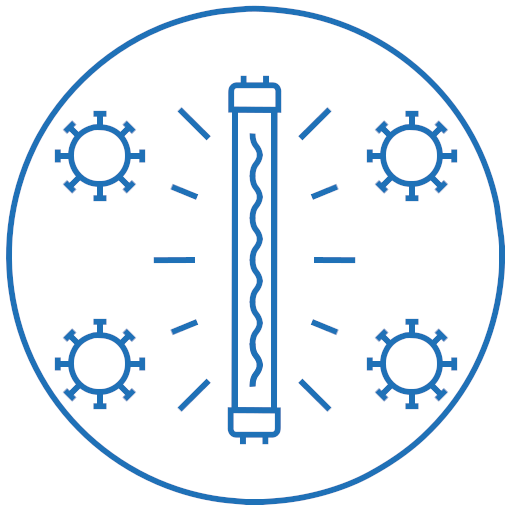

# Autonomous Surface Disinfection Robot 

<p align="center">
  
  
</p>

## Dependencies
```
https://github.com/ros/ros
https://gitlab.com/libeigen/eigen
https://github.com/PointCloudLibrary/pcl
https://github.com/microsoft/cpprestsdk
https://github.com/wjwwood/serial
https://github.com/andrew-gresyk/HFSM2
```

## Build ASDR
```
cd Backend/ROS
catkin_make
source devel/setup.sh
```

## Launch ASDR
```
roslaunch launch/asdr.launch
```
